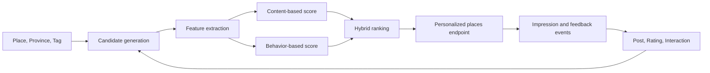
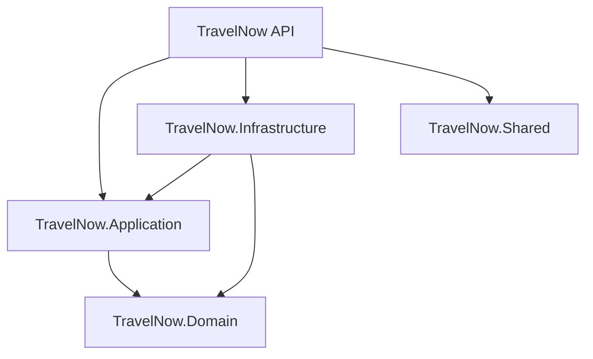

# TravelNow

TravelNow is a travel discovery and recommendation platform. Its long-term goal is to help people find destinations that match their interests, location preferences, travel style, and past behavior while providing a community space for posts, photos, ratings, and discussion.

The repository currently contains the backend foundation for that product: an ASP.NET Core API, a PostgreSQL Code First schema, a paginated places endpoint, Docker Compose support, Swagger, and automated test projects. Personalized recommendations, authentication endpoints, content publishing workflows, and administration features are planned but are not yet complete.

## Table of contents

- [Product vision](#product-vision)
- [Problem statement](#problem-statement)
- [Primary objectives](#primary-objectives)
- [Target users and core journeys](#target-users-and-core-journeys)
- [Current implementation status](#current-implementation-status)
- [Recommendation strategy](#recommendation-strategy)
- [Architecture](#architecture)
- [Data model](#data-model)
- [Technology stack](#technology-stack)
- [Prerequisites](#prerequisites)
- [Configuration](#configuration)
- [Run the project](#run-the-project)
- [Run from Visual Studio](#run-from-visual-studio)
- [Connect with pgAdmin](#connect-with-pgadmin)
- [API reference](#api-reference)
- [Entity Framework Core migrations](#entity-framework-core-migrations)
- [Testing](#testing)
- [Repository structure](#repository-structure)
- [Development workflow](#development-workflow)
- [Roadmap](#roadmap)
- [Known limitations](#known-limitations)
- [Troubleshooting](#troubleshooting)
- [Security notes](#security-notes)

## Product vision

Travel planning usually requires users to combine information from search engines, social networks, review platforms, maps, and personal recommendations. These sources often optimize for popularity rather than personal relevance. TravelNow is intended to provide one place where users can discover destinations, understand why those destinations are relevant, and learn from the experience of other travelers.

The intended product experience is:

1. A user provides explicit preferences or starts browsing destinations.
2. TravelNow builds an interest profile from selected topics and behavioral signals.
3. The recommendation service generates destination candidates from location, tags, ratings, and community content.
4. Candidates are ranked by personal relevance, quality, freshness, and business rules.
5. User feedback improves future recommendations.

The product should eventually support web, mobile, and administrative clients through the same backend API.

## Problem statement

Travel discovery has several recurring problems:

- Popular destinations dominate search results even when they do not match the user's interests.
- Information about a destination is fragmented across posts, photos, reviews, and maps.
- Static lists do not learn from user behavior.
- Community recommendations can become noisy without ranking, moderation, and quality signals.
- New users have no interaction history, creating a recommendation cold-start problem.
- New destinations have limited engagement data and can be difficult to surface.

TravelNow aims to address these problems through structured destination data, community-generated content, and a recommendation pipeline that can evolve from simple rules into a hybrid ranking system.

## Primary objectives

### 1. Make destination discovery efficient

Users should be able to browse and search destinations without knowing an exact name in advance. Discovery should support:

- Keyword search.
- Province or region filters.
- Topic and activity tags.
- Stable, bounded pagination.
- Popular, recent, nearby, and personalized views.
- Clear destination context such as province, location, media, and relevant posts.

The current API implements the first foundation: paginated place lookup with province and keyword filters.

### 2. Deliver explainable personalized recommendations

Recommendations should not be a black box. The system should be able to associate a recommendation with understandable reasons, for example:

- Similar to destinations the user saved.
- Matches preferred tags such as nature, food, culture, or adventure.
- Popular among users with similar interests.
- Relevant to a selected province or planned trip.
- Highly rated or recently trending.

The first recommendation version should favor deterministic, inspectable scoring before introducing more complex machine-learning models.

### 3. Build a useful travel community

Destinations become more valuable when paired with real experiences. TravelNow is designed to support:

- User-authored travel posts.
- Photos and other media.
- Ratings and written experiences.
- Threaded comments and discussion.
- Tags that connect content to destinations and interests.
- Moderation and reporting workflows.

The domain schema for posts, media, comments, and tags already exists. The corresponding HTTP APIs are future work.

### 4. Create a measurable feedback loop

A recommendation system needs reliable feedback. TravelNow should record events such as:

- Recommendation impressions.
- Destination and post views.
- Click-throughs.
- Saves, likes, shares, and dismissals.
- Ratings and comments.
- Search queries and filter selections.

These signals should support both product analytics and model evaluation. The current `UserInteraction` entity is only a starting point and will need event type, timestamp, source, and context fields before it can support production recommendation training.

### 5. Provide a maintainable backend platform

The backend should be safe to evolve as the product grows. Important engineering objectives include:

- Clear project boundaries and dependency direction.
- Explicit HTTP contracts.
- PostgreSQL Code First migrations that can be reviewed and reproduced.
- Consistent error responses.
- Soft delete and audit metadata.
- Automated unit and integration tests.
- Containerized local development.
- Secure secret and connection-string handling.
- Observable recommendation and API behavior.

## Target users and core journeys

### Traveler

- Search for destinations in a province.
- Discover destinations by interest.
- View destination details and related posts.
- Save destinations for a future trip.
- Receive recommendations based on preferences and behavior.

### Community contributor

- Publish a travel post associated with a destination.
- Upload media and provide a rating.
- Tag content so that it can be discovered and recommended.
- Reply to comments and update published content.

### Moderator or administrator

- Manage provinces, destinations, and tags.
- Review reported content.
- Correct duplicate or inaccurate destination data.
- Monitor recommendation quality and platform usage.

Only the place-listing journey currently has an implemented HTTP endpoint. The remaining journeys describe product direction, not completed behavior.

## Current implementation status

| Area | Status | Details |
| --- | --- | --- |
| Place listing | Implemented | Pagination, province filtering, and case-insensitive name search |
| PostgreSQL schema | Implemented | Identity, provinces, places, tags, posts, media, comments, and interactions |
| Code First migrations | Implemented | Design-time factory, local EF tool manifest, snapshot, and PostgreSQL-specific mappings |
| Docker Compose | Implemented | API, PostgreSQL, health check, shared network, and persistent volume |
| Swagger/OpenAPI | Implemented | Available in the Development environment |
| Soft delete | Implemented | Global query filters for entities that implement `IIsDeletedEntity` |
| Audit fields | Implemented | Created/updated timestamps and actor IDs |
| Error handling | Implemented | Central exception middleware returning Problem Details |
| Automated tests | Foundation implemented | Application unit tests and API integration tests use xUnit |
| Authentication endpoints | Not implemented | ASP.NET Core Identity schema and services are registered |
| Place details and CRUD | Not implemented | Planned after the listing API |
| Post/comment/media APIs | Not implemented | Domain and database schema exist |
| Seed data | Not implemented | A migrated database starts with empty business tables |
| Recommendation API | Not implemented | Recommendation design is described below |

## Recommendation strategy

TravelNow is expected to evolve through several recommendation stages rather than starting with a complex model that has no training data.

### Stage 1: rules and content-based scoring

Candidate destinations can be scored using:

- Preferred tags.
- Province or region preference.
- Destination popularity.
- Average post rating.
- Content freshness.
- Similarity to places the user viewed or saved.

This stage is suitable for cold-start users because explicit preferences and destination metadata are enough to generate results.

### Stage 2: behavioral similarity

After enough interaction data exists, TravelNow can add:

- User-to-user similarity.
- Item-to-item similarity.
- Collaborative filtering.
- Co-view and co-save statistics.
- Session-based recommendations.

### Stage 3: hybrid ranking

A hybrid ranker can combine content and behavior scores with operational constraints:

```text
finalScore =
    contentScore * contentWeight
  + behaviorScore * behaviorWeight
  + qualityScore * qualityWeight
  + freshnessScore * freshnessWeight
  + explorationBoost
  - safetyOrPolicyPenalty
```

The formula is illustrative. Actual weights should be versioned, measured, and changed through experiments.

### Planned recommendation pipeline



### Evaluation goals

Recommendation quality should eventually be evaluated with:

- Precision and recall at K.
- Normalized discounted cumulative gain (NDCG).
- Click-through rate.
- Save or booking-intent rate.
- Diversity and destination coverage.
- Novelty and exploration rate.
- User retention and repeat sessions.
- Cold-start performance.

No recommendation model or evaluation pipeline is implemented yet.

## Architecture

The solution is split into projects by responsibility:



| Project | Responsibility |
| --- | --- |
| `TravelNow` | ASP.NET Core API, controllers, HTTP models, middleware, Swagger, and composition root |
| `TravelNow.Application` | Use cases, handlers, query/result models, and persistence abstractions |
| `TravelNow.Domain` | Entities, enums, domain exceptions, audit contracts, and soft-delete contracts |
| `TravelNow.Infrastructure` | EF Core, Npgsql, Identity stores, repositories, entity configurations, and migrations |
| `TravelNow.Shared` | Shared helper functions |
| `tests/TravelNow.Application.UnitTests` | Unit tests for application behavior |
| `tests/TravelNow.Api.IntegrationTests` | Integration tests for HTTP contracts |

### Current request flow

```text
HTTP request
  -> Controller
  -> Application handler
  -> Persistence abstraction
  -> EF Core implementation
  -> PostgreSQL
```

The API project is the composition root. It registers Application and Infrastructure services in `Program.cs`.

### Error handling

`ExceptionHandlingMiddleware` converts known exceptions into RFC-style Problem Details responses and adds a `traceId`. Unexpected exceptions are logged and return HTTP 500 without exposing internal exception details.

## Data model

### Main relationships

- `Province 1 - N Place`: a province contains many destinations.
- `Place N - N Tag`: destinations are categorized through `PlaceTag`.
- `User 1 - N Post`: users author travel posts.
- `Post N - N Tag`: posts are categorized through `PostTag`.
- `Post 1 - N PostMedia`: a post can contain multiple media records.
- `Post 1 - N Comment`: a post can contain multiple comments.
- `Comment 1 - N Comment`: comments support threaded replies.
- `User N - N Post`: behavioral signals are represented by `UserInteraction`.
- ASP.NET Core Identity manages users, roles, claims, logins, role membership, and tokens with `Guid` keys.

### Cross-cutting entity behavior

Entities derived from `BaseEntity` contain:

```text
Id
CreatedAt
CreatedBy
UpdatedAt
UpdatedBy
IsDeleted
```

`TravelNowDbContext` applies global soft-delete filters to entities that implement `IIsDeletedEntity`. Join entities with required filtered principals have matching filters to avoid returning relationships whose principal has been deleted.

### Database tables

After all current migrations are applied, `TravelNowDb` contains the following application and Identity tables:

```text
Comments
PlaceTags
Places
PostMedias
PostTags
Posts
ProvinceMedias
Provinces
RoleClaims
Roles
Tags
UserClaims
UserInteractions
UserLogins
UserRoles
UserTokens
Users
__EFMigrationsHistory
```

## Technology stack

- .NET 10
- ASP.NET Core Web API
- Entity Framework Core 10
- Npgsql Entity Framework Core provider
- PostgreSQL 17 Alpine
- ASP.NET Core Identity
- Swagger/OpenAPI with Swashbuckle
- Mapster
- xUnit
- `Microsoft.AspNetCore.Mvc.Testing`
- Docker and Docker Compose

## Prerequisites

Install the following before running the project:

- .NET SDK 10
- Docker Desktop with Docker Compose v2
- Git
- Visual Studio 2026 or a compatible editor is optional
- pgAdmin or another PostgreSQL client is optional

Verify the required command-line tools:

```powershell
dotnet --version
docker --version
docker compose version
git --version
```

Docker Desktop must be running before any Compose command is executed.

## Configuration

TravelNow uses two related but separate configuration mechanisms during local development.

| Setting | Consumer | Purpose |
| --- | --- | --- |
| `TRAVELNOW_DB_PASSWORD` | Docker Compose | Sets the PostgreSQL password and constructs the API container connection string |
| `ConnectionStrings__DefaultConnection` | .NET API and EF CLI | Overrides `ConnectionStrings:DefaultConnection` for local processes |
| `ASPNETCORE_ENVIRONMENT` | ASP.NET Core | Enables Development behavior such as Swagger |
| `ASPNETCORE_HTTP_PORTS` | API container | Configures the container HTTP listener |

Important: Docker Compose reads `TravelNow/.env`, but `dotnet ef` does not automatically import that file into the host process. Set `ConnectionStrings__DefaultConnection` in the terminal before running migrations if the password differs from local JSON configuration.

Never commit real passwords to `appsettings.json`, `.env.example`, or source code. Use `.env`, .NET User Secrets, environment variables, or a deployment secret manager.

## Run the project

The shortest working path is Docker Compose for PostgreSQL plus the API. Run these commands from the repository root.

### 1. Configure the database password

```powershell
Copy-Item .\TravelNow\.env.example .\TravelNow\.env
notepad .\TravelNow\.env
```

Set a local password in `TravelNow/.env`:

```env
TRAVELNOW_DB_PASSWORD=your-local-password
```

The `.env` file is ignored by Git and must not be committed.

### 2. Start PostgreSQL

```powershell
docker compose --env-file .\TravelNow\.env -f .\TravelNow\docker-compose.yml up -d travelnow-db
```

PostgreSQL is available from the host at `localhost:5433` with database `TravelNowDb` and user `postgres`.

### 3. Configure EF CLI and apply the schema

`dotnet ef` does not automatically import the Compose `.env` file. Set the same password in the current terminal, then restore the local tool and apply migrations:

```powershell
$dbPassword = "your-local-password"
$env:ConnectionStrings__DefaultConnection = "Host=localhost;Port=5433;Database=TravelNowDb;Username=postgres;Password=$dbPassword"

dotnet tool restore
dotnet ef database update `
  --project .\TravelNow.Infrastructure\TravelNow.Infrastructure.csproj `
  --startup-project .\TravelNow\TravelNow.csproj `
  --context TravelNowDbContext
```

Migrations create the schema but do not seed destination data.

### 4. Build and start the API

```powershell
docker compose --env-file .\TravelNow\.env -f .\TravelNow\docker-compose.yml up -d --build travelnow-api
```

Open:

- API: `http://localhost:8080`
- Swagger: `http://localhost:8080/swagger/index.html`

Check status or logs:

```powershell
docker compose --env-file .\TravelNow\.env -f .\TravelNow\docker-compose.yml ps
docker compose --env-file .\TravelNow\.env -f .\TravelNow\docker-compose.yml logs -f travelnow-api
```

### Run the API locally instead of in Docker

Keep `travelnow-db` running, set `ConnectionStrings__DefaultConnection` as above, and run:

```powershell
dotnet run --project .\TravelNow\TravelNow.csproj --launch-profile http
```

Local URLs are `http://localhost:5252` and `http://localhost:5252/swagger/index.html`.

### Visual Studio

Open `TravelNow.slnx`, choose `TravelNow` for local API debugging or `docker-compose` to run both services. If Visual Studio reports a missing `TravelNow.dll`, rebuild the Debug project first:

```powershell
dotnet build .\TravelNow\TravelNow.csproj --configuration Debug
```

### Stop or reset

Stop services while keeping database data:

```powershell
docker compose --env-file .\TravelNow\.env -f .\TravelNow\docker-compose.yml down
```

To delete the local database volume and recreate an empty database, use `down -v`. This is destructive for local data.
## Connect with pgAdmin

For pgAdmin installed directly on the host:

```text
Name: TravelNow Local
Host: localhost
Port: 5433
Maintenance database: TravelNowDb
Username: postgres
Password: value from TRAVELNOW_DB_PASSWORD
```

Navigate to:

```text
Servers
`-- TravelNow Local
    `-- Databases
        `-- TravelNowDb
            `-- Schemas
                `-- public
                    `-- Tables
```

Refresh `Databases` and `Tables` after applying migrations.

If pgAdmin itself runs in Docker, use one of these connection options:

- `host.docker.internal:5433` when connecting through the host-published port.
- `travelnow-db:5432` when pgAdmin is attached to the same Docker network.

## API reference

### List places

```http
GET /api/places
```

Query parameters:

| Parameter | Type | Default | Rules | Description |
| --- | --- | --- | --- | --- |
| `page` | integer | `1` | Minimum 1 | Requested page |
| `pageSize` | integer | `20` | 1 to 100 | Number of records per page |
| `provinceId` | GUID | null | Valid GUID | Restrict results to a province |
| `keyword` | string | null | Maximum 200 characters | Case-insensitive place-name search |

Examples:

```http
GET /api/places?page=1&pageSize=20
GET /api/places?page=2&pageSize=10&keyword=da%20nang
GET /api/places?page=1&pageSize=20&provinceId=00000000-0000-0000-0000-000000000000
```

PowerShell:

```powershell
Invoke-RestMethod "http://localhost:8080/api/places?page=1&pageSize=20&keyword=da%20nang"
```

Successful response:

```json
{
  "items": [
    {
      "id": "00000000-0000-0000-0000-000000000000",
      "name": "Example place",
      "provinceId": "00000000-0000-0000-0000-000000000000",
      "provinceName": "Example province",
      "location": "Example address"
    }
  ],
  "page": 1,
  "pageSize": 20,
  "totalCount": 1,
  "totalPages": 1
}
```

An empty migrated database returns:

```json
{
  "items": [],
  "page": 1,
  "pageSize": 20,
  "totalCount": 0,
  "totalPages": 0
}
```

Invalid query values are rejected by ASP.NET Core model validation.

### Error response format

Application exceptions are returned as `application/problem+json`:

```json
{
  "type": "about:blank",
  "title": "Resource not found",
  "status": 404,
  "detail": "The requested resource was not found.",
  "instance": "/api/example",
  "traceId": "request-trace-id"
}
```

Use `traceId` to correlate an API response with server logs.

## Entity Framework Core migrations

The repository contains a local `dotnet-ef` tool manifest so contributors use a compatible EF CLI version.

### Restore the tool

```powershell
dotnet tool restore
dotnet ef --version
```

### List migrations

```powershell
dotnet ef migrations list `
  --project .\TravelNow.Infrastructure\TravelNow.Infrastructure.csproj `
  --startup-project .\TravelNow\TravelNow.csproj `
  --context TravelNowDbContext
```

### Check for model changes without a migration

```powershell
dotnet ef migrations has-pending-model-changes `
  --project .\TravelNow.Infrastructure\TravelNow.Infrastructure.csproj `
  --startup-project .\TravelNow\TravelNow.csproj `
  --context TravelNowDbContext
```

Expected result when the snapshot is current:

```text
No changes have been made to the model since the last migration.
```

### Add a migration

After changing an entity or EF configuration:

```powershell
dotnet ef migrations add YourMigrationName `
  --project .\TravelNow.Infrastructure\TravelNow.Infrastructure.csproj `
  --startup-project .\TravelNow\TravelNow.csproj `
  --context TravelNowDbContext `
  --output-dir Migrations
```

Review all generated operations, especially:

- Column type changes.
- Nullable to non-nullable changes.
- Table or column drops.
- Default values.
- PostgreSQL casts.
- Index and foreign-key changes.

### Apply migrations

```powershell
dotnet ef database update `
  --project .\TravelNow.Infrastructure\TravelNow.Infrastructure.csproj `
  --startup-project .\TravelNow\TravelNow.csproj `
  --context TravelNowDbContext
```

### Generate a SQL migration script

```powershell
dotnet ef migrations script `
  --project .\TravelNow.Infrastructure\TravelNow.Infrastructure.csproj `
  --startup-project .\TravelNow\TravelNow.csproj `
  --context TravelNowDbContext `
  --idempotent `
  --output .\artifacts\travelnow-migrations.sql
```

Create the `artifacts` directory first if it does not exist. Do not commit generated scripts that contain environment-specific information.

### Remove the latest unapplied migration

Only use this when the latest migration has not been applied to a shared database:

```powershell
dotnet ef migrations remove `
  --project .\TravelNow.Infrastructure\TravelNow.Infrastructure.csproj `
  --startup-project .\TravelNow\TravelNow.csproj `
  --context TravelNowDbContext
```

Never rewrite migration history that other environments already depend on. Add a corrective migration instead.

## Testing

### Build the solution

```powershell
dotnet restore .\TravelNow.slnx
dotnet build .\TravelNow.slnx --configuration Debug --no-restore
```

### Run all tests

```powershell
dotnet test .\TravelNow.slnx --configuration Debug --no-restore
```

### Run application unit tests

```powershell
dotnet test `
  .\tests\TravelNow.Application.UnitTests\TravelNow.Application.UnitTests.csproj `
  --configuration Debug
```

### Run API integration tests

```powershell
dotnet test `
  .\tests\TravelNow.Api.IntegrationTests\TravelNow.Api.IntegrationTests.csproj `
  --configuration Debug
```

### Useful validation before a pull request

```powershell
dotnet build .\TravelNow.slnx --configuration Debug
dotnet test .\TravelNow.slnx --configuration Debug --no-build

dotnet ef migrations has-pending-model-changes `
  --project .\TravelNow.Infrastructure\TravelNow.Infrastructure.csproj `
  --startup-project .\TravelNow\TravelNow.csproj `
  --context TravelNowDbContext
```

## Repository structure

| Project | Responsibility |
| --- | --- |
| `TravelNow` | ASP.NET Core API, controllers, middleware, Swagger, and startup configuration |
| `TravelNow.Application` | Use cases, handlers, DTOs, and persistence abstractions |
| `TravelNow.Domain` | Entities, enums, exceptions, audit, and soft-delete contracts |
| `TravelNow.Infrastructure` | EF Core, PostgreSQL, Identity, repositories, configurations, and migrations |
| `TravelNow.Shared` | Shared helpers |
| `tests/*` | Application unit tests and API integration tests |

Important runtime files:

```text
TravelNow/docker-compose.yml                  Docker services
TravelNow/Dockerfile                          API image
TravelNow/Program.cs                          Application startup
TravelNow.Infrastructure/TravelNowDbContext.cs EF Core context
TravelNow.Infrastructure/Migrations/           Database migrations
TravelNow.Infrastructure/TravelNowDbContextFactory.cs EF design-time setup
.config/dotnet-tools.json                     Local dotnet-ef version
```
## Development workflow

### Adding an API feature

1. Define or update domain concepts only when domain behavior changes.
2. Add an Application use case and persistence abstraction.
3. Implement the persistence adapter in Infrastructure.
4. Add the HTTP request/response contract and controller action in the API project.
5. Add unit tests for the use case.
6. Add integration tests for the HTTP contract.
7. Create and review an EF migration when the database model changes.
8. Run build, tests, and pending-model validation.

### Commit and pull-request guidance

Use clear conventional commit prefixes:

```text
feat: add personalized place recommendations
fix: correct PostgreSQL place filtering
chore: update local development tooling
docs: expand project setup guide
test: cover place pagination validation
```

A database pull request should explain:

- Why the schema changes.
- Whether existing data is transformed.
- Whether an operation can lose data.
- How rollback works.
- Which commands were used to verify the migration.

## Roadmap

### Phase 1: backend foundation

- Complete CRUD for provinces, places, and tags.
- Add reliable seed/import data for Vietnamese destinations.
- Add authentication and authorization endpoints.
- Complete access-token and refresh-token workflows.
- Improve validation, logging, and test coverage.
- Remove vulnerable or outdated dependencies.

### Phase 2: community content

- Add post creation, editing, deletion, and retrieval APIs.
- Add media upload and storage integration.
- Add ratings and threaded comments.
- Add saves, likes, shares, and richer interaction events.
- Add content reporting and moderation.
- Add destination ownership and administrative workflows.

### Phase 3: recommendation MVP

- Define a destination taxonomy and controlled tag set.
- Build user preference profiles.
- Implement content-based candidate scoring.
- Add personalized and related-destination endpoints.
- Record recommendation impressions and feedback.
- Add offline recommendation evaluation.

### Phase 4: hybrid recommendation

- Add collaborative filtering or embedding-based retrieval.
- Implement hybrid ranking and exploration rules.
- Add model/version metadata to recommendation responses.
- Add A/B testing and ranking observability.
- Improve diversity, novelty, and cold-start behavior.

### Phase 5: context-aware travel planning

- Recommend by distance, season, weather, budget, and trip duration.
- Build itinerary planning and saved collections.
- Add map and geospatial search.
- Add notifications for saved destinations and travel plans.
- Support localization and multilingual destination content.

## Known limitations

- Only the place-listing HTTP endpoint is currently implemented.
- There is no seed data, so a new database returns no places.
- Authentication services and tables exist, but authentication endpoints do not.
- `UserInteraction` does not yet model event type or recommendation context.
- Recommendation logic and personalized endpoints do not exist yet.
- Media storage is represented in the schema but has no upload implementation.
- Current PostgreSQL migrations must be executed manually.
- HTTPS redirection inside the HTTP-only container can emit a development warning.
- The dependency graph currently reports an `NU1903` advisory for `Microsoft.OpenApi`.

## Troubleshooting

### `TRAVELNOW_DB_PASSWORD is missing a value`

Compose cannot interpolate the required password.

1. Create `TravelNow/.env` from `.env.example`.
2. Set a non-empty `TRAVELNOW_DB_PASSWORD`.
3. Run Compose with `--env-file .\TravelNow\.env` when the terminal is at the repository root.

### The migration file exists but PostgreSQL has no tables

Migration source files do not update a database automatically. Run:

```powershell
dotnet ef database update `
  --project .\TravelNow.Infrastructure\TravelNow.Infrastructure.csproj `
  --startup-project .\TravelNow\TravelNow.csproj `
  --context TravelNowDbContext
```

Then refresh `Schemas -> public -> Tables` in pgAdmin.

### `PendingModelChangesWarning`

The EF model differs from the migration snapshot. Do not suppress the warning just to force an update.

1. Review recent entity and configuration changes.
2. Add a new migration.
3. Inspect the generated operations.
4. Run `database update` only after the migration is correct.

### `dotnet ef` is not available

Restore the repository-local tool:

```powershell
dotnet tool restore
```

If NuGet cannot be reached, verify network access to `api.nuget.org` and retry.

### `TravelNowDb` is not visible in pgAdmin

Confirm that pgAdmin is connected to the Docker-published instance:

```text
Host: localhost
Port: 5433
Database: TravelNowDb
Username: postgres
```

Port `5432` may belong to a different PostgreSQL installation on the host.

### The API returns HTTP 500 with `relation "Places" does not exist`

The API reached PostgreSQL, but migrations were applied to another database or were not applied at all.

1. Verify `ConnectionStrings__DefaultConnection` points to `localhost:5433` for host EF commands.
2. Verify the API container uses `travelnow-db:5432`.
3. Run `dotnet ef database update` against `TravelNowDb`.
4. Confirm the `Places` table exists.

### The API returns an empty `items` array

This is expected for a new database. Migrations create schema, not destination records. Seed or import provinces and places before testing search results.

### `TravelNow.dll` was not found when starting Docker Compose from Visual Studio

Build the Debug output first:

```powershell
dotnet build .\TravelNow\TravelNow.csproj --configuration Debug
```

Then rebuild/restart the Docker Compose project in Visual Studio.

### Port 8080 gives an empty response

Check the process inside the container:

```powershell
docker top travelnow-api
```

The normal command is `dotnet TravelNow.dll`. If only a Visual Studio debug helper is running, stop the IDE debug session and recreate the service:

```powershell
docker compose `
  --env-file .\TravelNow\.env `
  -f .\TravelNow\docker-compose.yml `
  up -d --build --force-recreate
```

### Docker reports that a container name is already in use

List conflicting containers:

```powershell
docker ps -a --filter name=travelnow
```

Stop the active Visual Studio Compose session before recreating services. Do not remove volumes unless local database data can be discarded.

### `NU1903` reports a vulnerable `Microsoft.OpenApi` package

This warning does not block builds or migrations, but it should not be ignored for production. Update the direct or transitive dependency to a patched compatible version and rerun build/tests before merging.

## Security notes

- Never commit `.env`, database passwords, API tokens, or production connection strings.
- Prefer environment variables, .NET User Secrets, or a deployment secret manager.
- Use different credentials for local, test, staging, and production environments.
- Review every migration before applying it to a database with real data.
- Back up production data before destructive schema operations.
- Do not run `docker compose down -v` when a local volume contains data that must be preserved.
- Do not expose detailed exception messages to API consumers.
- Protect authentication tokens at rest and rotate compromised credentials.
- Add authorization policies before exposing administrative or content-mutation endpoints.
